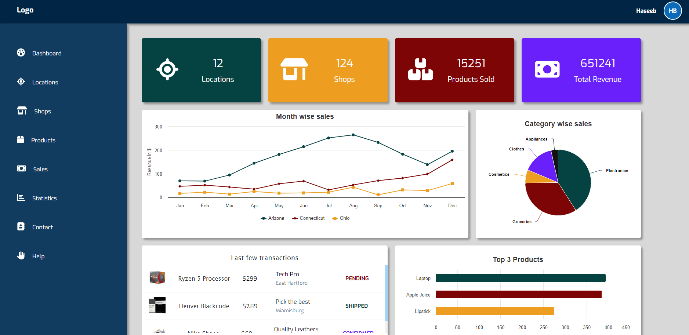

# Dashboard Portal Using Angular

This project is an Angular dashboard application that allows users to navigate through the dashboard of the account. Navigating through different widgets, graphs, charts and others. Different libraries are used to achieve the tasks like Angular-highcharts for displaying of charts, and font-awesome for icons.

## Development server

To run the development server, follow these steps:

1. Install the Angular CLI by running `npm install -g @angular/cli`.
2. Clone the repository and navigate to the project directory.
3. Run `npm install` to install the project dependencies.
4. Run `ng serve` for a dev server.
5. Navigate to `http://localhost:4200/` in your web browser.

The application will automatically reload if you change any of the source files.

